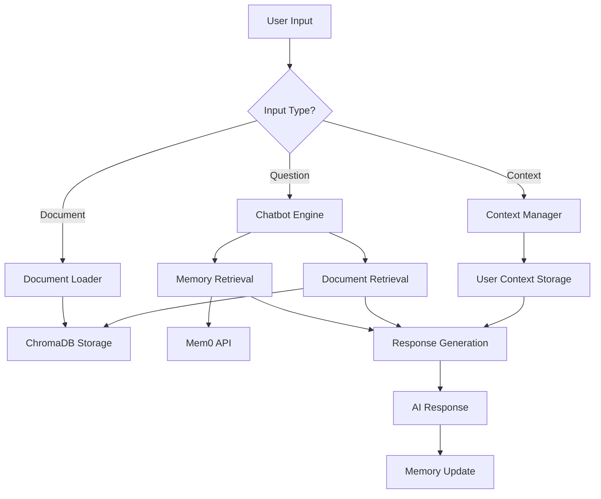

# ChatBot Memory

An intelligent conversational AI system with persistent memory, document understanding, and personalized context management. Built with LangChain, ChromaDB, and advanced retrieval techniques.

## Features

### **Persistent Memory System**
- **Long-term Memory**: Remembers conversations across sessions using Mem0
- **User Context**: Customizable user profiles and preferences
- **Conversation History**: Maintains context throughout interactions

### **Document Intelligence**
- **PDF Processing**: Load and analyze PDF documents
- **Smart Retrieval**: Hybrid search combining BM25 and semantic similarity
- **Document Classification**: Automatically categorizes uploaded content
- **Contextual Relevance**: Finds information relevant to current conversation


## Quick Start

### Prerequisites
- Python 3.8+
- CUDA-compatible GPU (optional, for faster embeddings)

### Installation

1. **Clone the repository**
   ```bash
   git clone https://github.com/adeliie/ChatBot_memory.git
   cd ChatBot_memory
   ```

2. **Install dependencies**
   ```bash
   pip install -r requirements.txt
   ```

3. **Install Ollama and download model**
   ```bash
   # Install Ollama (visit https://ollama.ai for platform-specific instructions)
   ollama pull llama3
   ```

4. **Configure API keys**
   ```bash
   cp .env.example .env
   # Edit .env and add your Mem0 API key
   ```

5. **Run the chatbot**
   ```bash
   python main.py
   ```

## 💡 Usage Examples

### Basic Conversation
```
You: Hello, how are you?
AI: Hello! I'm doing well and ready to help you with any questions or tasks you have.
```

### Document Loading
```
You: load document /path/to/your/document.pdf
AI: 📄 Document '/path/to/your/document.pdf' loaded successfully.
```

### Setting User Context
```
You: set_context I'm a software developer interested in Python and AI
AI: ✅ Your user context has been updated.
```

## 🏗️ Architecture

### Core Components

#### 🧮 **State Management (`graph_setup.py`)**
- **LangGraph Integration**: Manages conversation flow and routing
- **Conditional Routing**: Automatically handles different input types
- **State Persistence**: Maintains conversation state across interactions

#### 🤖 **Chatbot Engine (`chatbot.py`)**
- **Context Integration**: Combines memory, documents, and conversation history
- **Intelligent Response**: Uses retrieved context to provide relevant answers
- **Memory Management**: Automatically stores conversations for future reference

#### 📄 **Document Processing (`document.py`)**
- **PDF Loading**: Extracts and processes PDF content
- **Smart Chunking**: Optimally splits documents for retrieval
- **Type Classification**: Automatically categorizes document content

#### 🔍 **Memory & Retrieval (`memory_db.py`)**
- **Hybrid Search**: Combines BM25 and semantic similarity
- **Relevance Filtering**: Multi-layer relevance scoring
- **User Context Storage**: Persistent user preference management

#### ⚙️ **Configuration (`config.py`)**
- **Model Setup**: Configures LLM and embedding models
- **API Management**: Handles external service connections
- **Device Optimization**: Automatic GPU/CPU selection

### Data Flow



## 🔧 Configuration

### Environment Variables
Create a `.env` file with:
```env
MEM0_API_KEY=your_mem0_api_key_here
```

### Model Configuration
The system uses:
- **LLM**: Ollama Llama3 (configurable in `config.py`)
- **Embeddings**: HuggingFace `sentence-transformers/all-MiniLM-L6-v2`
- **Vector Store**: ChromaDB for document storage
- **Memory**: Mem0 for conversation memory

## 📁 Project Structure

```
ChatBot_memory/
├── main.py              # Application entry point
├── config.py            # Configuration and model setup
├── chatbot.py           # Main conversation logic
├── memory_db.py         # Memory and document management
├── document.py          # Document processing
├── graph_setup.py       # State graph configuration
├── utils.py             # Utility functions
├── requirements.txt     # Python dependencies
├── .env.example         # Environment template
├── .gitignore          # Git ignore rules
├── chroma_db/          # Document vector storage (created automatically)
└── user_contexts/      # User context files (created automatically)
```

## 🎛️ Advanced Features

### Smart Document Retrieval
- **Contextual Filtering**: Only searches documents relevant to the conversation
- **Multi-Score Ranking**: Combines semantic, keyword, and context scores
- **Adaptive Thresholds**: Dynamic relevance filtering

### Memory Management
- **Selective Memory**: Stores relevant conversation parts
- **User Profiling**: Builds user preference profiles over time
- **Context Persistence**: Maintains user settings across sessions

### Conversation Intelligence
- **Intent Recognition**: Understands different types of user inputs
- **Context Integration**: Seamlessly weaves together multiple information sources
- **Response Optimization**: Provides concise, relevant answers

## 🛠️ Development

### Adding New Features
1. **New Node Types**: Add to `graph_setup.py`
2. **Custom Retrievers**: Extend `memory_db.py`
3. **Document Types**: Enhance `document.py`

### Testing
```bash
# Test with sample documents
python main.py
# Enter user ID: test_user
# Try: load document sample.pdf
# Try: What does the document discuss?
```

## 🔮 Future Enhancements

- [ ] **Multi-format Support**: Word, Excel, PowerPoint documents
- [ ] **Web Scraping**: URL content integration
- [ ] **Voice Interface**: Speech-to-text and text-to-speech
- [ ] **Multi-user Management**: Team collaboration features
- [ ] **API Endpoints**: REST API for integration
- [ ] **GUI Interface**: Web-based user interface

## 🤝 Contributing

1. Fork the repository
2. Create a feature branch (`git checkout -b feature/amazing-feature`)
3. Commit your changes (`git commit -m 'Add amazing feature'`)
4. Push to the branch (`git push origin feature/amazing-feature`)
5. Open a Pull Request

## 📄 License

This project is licensed under the MIT License - see the [LICENSE](LICENSE) file for details.

## 🙏 Acknowledgments

- **LangChain** for the conversational AI framework
- **ChromaDB** for vector storage capabilities
- **Mem0** for persistent memory management
- **HuggingFace** for embedding models
- **Ollama** for local LLM hosting

---

**Built with ❤️ for intelligent conversations**
